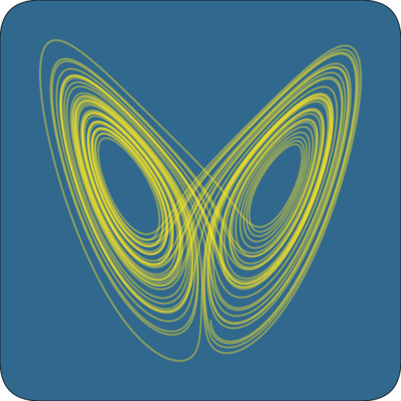

    

 

[comment]: <> (https://waldyrious.net/viridis-palette-generator/)
# ode_integrate

This package solves standard Ordinary Differential Equations (ODEs) in Rust.

## Documentation
Visit [crates.io/crates/ode_integrate](https://crates.io/crates/ode_integrate) for an overview of the package.
Visit [docs.rs/ode_integrate](https://docs.rs/ode_integrate) to view documentation of the code.

## Contributing
Please use [github](https://www.github.com/jonaspleyer/ode_integrate) to write a pull-request.
